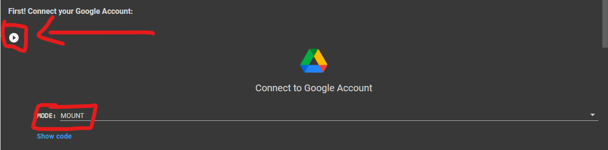
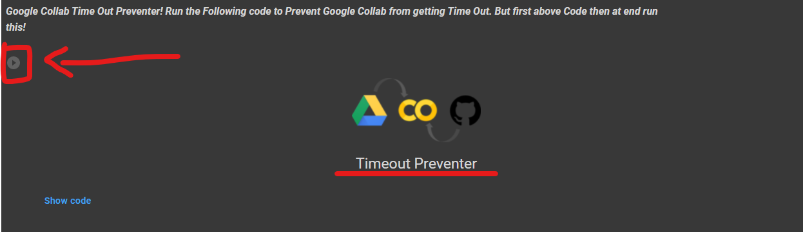
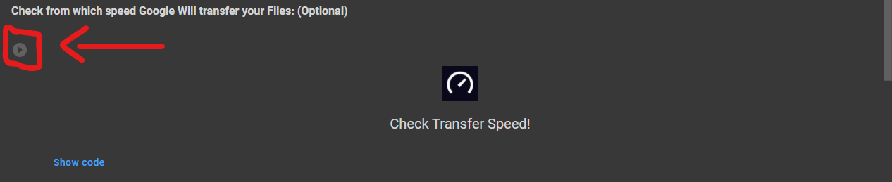
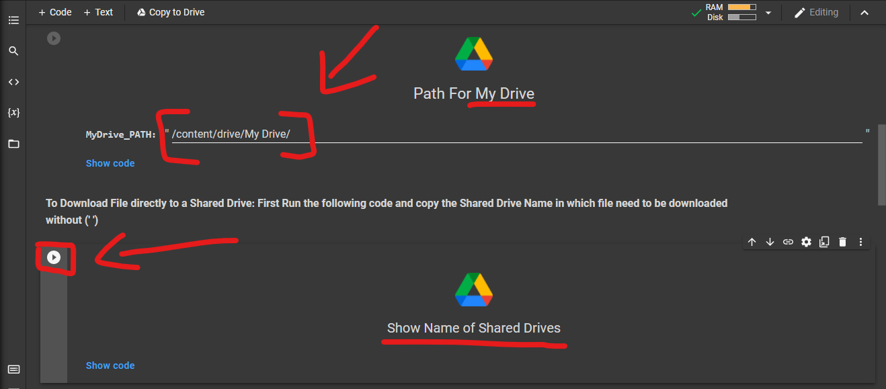
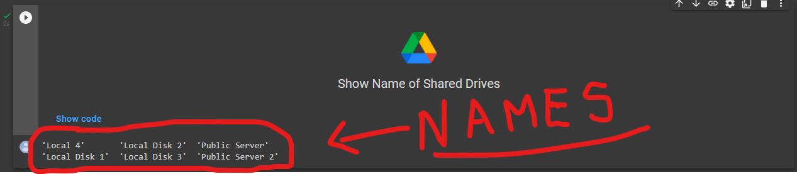
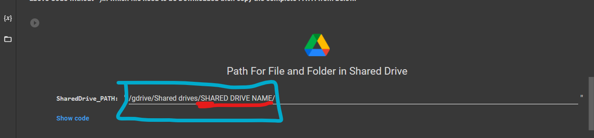
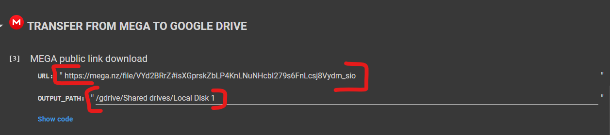
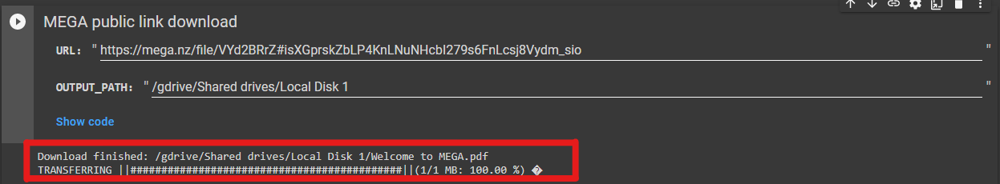

# Mega to Google Drive (UI Added!😊)
A Simple and User-Friendly Google Collab Notebook with UI to transfer your data from Mega to Google Drive.

## 🆕What's New?🆕

<b><i>v2.2.3</i></b>

<h4><b>1.Now Move Folders at once using its link</b></h4>

<b><i>v2.2.2</i></b>

<h4>1.Added New Timeout Preventer Advanced!😊</h4>
<h4>2.Direct Google Account Login!🤩</h4>
<h4>3.Added PATH Generator!😁</h4>
<h4>4.Integreated Speed Tester!😎</h4>
<h4>5.Added Time Out Preventer!😀</h4>
<h4>6.Fixed a Mounting Issue!😅</h4>
<h4>7.Added Shared Drives Support!😉</h4>
<h4>8.Fixed Output Error in Shared Drives!😑</h4>

## ⚙️ How to Use ? 
<h4> 1.First Open the Code in Google Collab!  </h4>
<h4> 2.It is too Simple! Choose "Mount" from the Dropdown list in "Connect Google Account" Section and click on play button. </h4>
 
<h4> 3.Now run the Timeout preventer to prevent Google Colab from getting Time out!</h4>

<h4> 4.If you want then you can also Check from which Speed Google is going to Transfer your Data!</h4>

<h4> 5.Now if you want to download file to My Drive then just copy the PATH as shown in the Image and go to STEP 7! While If you want to upload file to Shared Drive then copy the SHARED DRIVE NAME without (' ') by running the Code and read 5-6 STEP.</h4>

<h4> 6.After Running Code in STEP 4 you will see NAME of Available Shared Drives in your account, Just copy the NAME without (' ').</h4>

<h4> 7.After copying NAME of Shared Drives Paste in the "Path for Shared Drives" Section by Replacing "SHARED DRIVE NAME" and copy the Complete PATH!</h4>

<h4> 8.After Copying PATH for My Drive and Shared Drive! Copy the File URL/LINK (Stored in MEGA) which needs to be downloaded and paste it in URL then again paste the PATH which you copied from the Above Steps and paste it in OUTPUT_PATH and click "Play Code" button.</h4>

<h4> 9.Finally! Wait for the File to be downloaded in your Google Drive.</h4>

<h2>〽️Variables Used</h2>
<h4>1.SHARED DRIVE NAME: Replace with the Shared Drive name in which file needs to be downloaded.</h4>
<h4>2.PATH: Location or Address of particular File or Folder.</h4>
<h4>3.OUTPUT_PATH: Location or Address where a File will be downloaded.</h4>
<h4>4.URL: Link of File uploaded on MEGA CLOUD SERVICE.</h4>
<h4>5.MyDrive_PATH: Path of My Drive to download files in it.</h4>
<h4>6.SharedDrive_PATH: Path of Shared Drive to download files in it.</h4>
<h2> 🔐 Safe or Not? ✅</h2>
<h4> 1.Don't Worry! No data will be shared with anyone, if you use the <a href="https://github.com/TheCaduceus/Mega-to-Google-Drive">Original code</a>.🔒</h4>
<h4> 2.This code do not share even a single piece of data to any third party source and not create any log of that!🔑</h4>
<h4> 3.Do not trust any other copy of this Code.📚</h4>
<h2> 🤔 Why Use This?</h2>
<h4>If you use Google Collab for Long term use, then you can understand that it requires Human Interaction atleast one time per 90 Minutes! Otherwise it will cancel the task and all your Work will got failed! But this Repository comes with the code which prevent this. Yes you heard it right just click on the "Play Code Button" of "Timeout Preventer" and then don't worry about time out! Also sometimes it become defficult to upload Files directly to Shared Drives, So we have added a dedicated Shared Drive Section in the UI. We update every Repository on a regular Basis and fix Problems reported to us by our Users!</h4>
<h2> 📥Download</h2>
<h4> You can also Download this GitHub Repository as (.zip) file:</h4>
<h4> Available Versions for Download: </h4>
<h4> v2.2.3<a href="https://github.com/TheCaduceus/Mega-to-Google-Drive/archive/refs/tags/v2.2.3.zip"> Download Now</a> (Latest)</h4>
<h4> v2.2.2:<a href="https://github.com/TheCaduceus/Mega-to-Google-Drive/archive/refs/tags/v2.2.2.zip"> Download Now</a></h4>
<h4> v2.2.1:<a href="https://github.com/TheCaduceus/Mega-to-Google-Drive/archive/refs/tags/v2.2.1.zip"> Download Now</a></h4>
<h2>⛑Contact Us!</h2>
<h4>Join our Update Channel at Telegram:<a href="https://telegram.me/TheCaduceusUPDATE"> Join Now!</a>
<h4>Directly Contact the Developer using Telegram <a href="https://telegram.me/HelpAutomatted_Bot">@HelpAutomatted_Bot</a></h4>
<h2>❤️Credits & Thanks</h2>

<a href="https://github.com/TheCaduceus">Dr.Caduceus</a>: For making UI and Collab Notebook.

